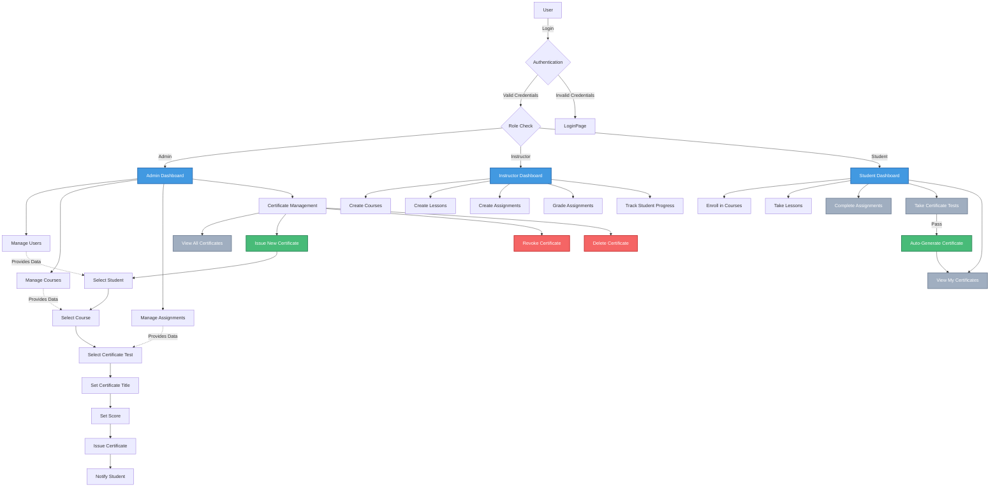

```mermaid
flowchart TD
    %% Main user types
    User[User] --> |Login| Auth{Authentication}
    Auth -->|Valid Credentials| Role{Role Check}
    Auth -->|Invalid Credentials| LoginPage

    %% Role-based access
    Role -->|Admin| AdminPanel[Admin Dashboard]
    Role -->|Instructor| InstructorPanel[Instructor Dashboard]
    Role -->|Student| StudentPanel[Student Dashboard]

    %% Admin Flow
    AdminPanel --> ManageUsers[Manage Users]
    AdminPanel --> ManageCourses[Manage Courses]
    AdminPanel --> ManageAssignments[Manage Assignments]
    AdminPanel --> CertificateManagement[Certificate Management]

    %% Certificate Management Flow
    CertificateManagement --> ViewCertificates[View All Certificates]
    CertificateManagement --> IssueCertificate[Issue New Certificate]
    CertificateManagement --> RevokeCertificate[Revoke Certificate]
    CertificateManagement --> DeleteCertificate[Delete Certificate]

    %% Issue Certificate Process
    IssueCertificate --> SelectStudent[Select Student]
    SelectStudent --> SelectCourse[Select Course]
    SelectCourse --> OptionalTest[Select Certificate Test]
    OptionalTest --> SetTitle[Set Certificate Title]
    SetTitle --> SetScore[Set Score]
    SetScore --> SubmitCertificate[Issue Certificate]
    SubmitCertificate --> NotifyStudent[Notify Student]

    %% Student Flow
    StudentPanel --> EnrollCourses[Enroll in Courses]
    StudentPanel --> TakeLessons[Take Lessons]
    StudentPanel --> CompleteAssignments[Complete Assignments]
    StudentPanel --> TakeCertificateTests[Take Certificate Tests]
    StudentPanel --> ViewMyCertificates[View My Certificates]
    TakeCertificateTests -->|Pass| AutoCertificate[Auto-Generate Certificate]
    AutoCertificate --> ViewMyCertificates

    %% Instructor Flow
    InstructorPanel --> CreateCourses[Create Courses]
    InstructorPanel --> CreateLessons[Create Lessons]
    InstructorPanel --> CreateAssignments[Create Assignments]
    InstructorPanel --> GradeAssignments[Grade Assignments]
    InstructorPanel --> TrackProgress[Track Student Progress]

    %% Data Flow
    ManageUsers -.->|Provides Data| SelectStudent
    ManageCourses -.->|Provides Data| SelectCourse
    ManageAssignments -.->|Provides Data| OptionalTest
    
    %% Style definitions
    classDef primary fill:#4299e1,stroke:#2b6cb0,stroke-width:2px,color:white
    classDef secondary fill:#a0aec0,stroke:#718096,stroke-width:2px,color:white
    classDef success fill:#48bb78,stroke:#2f855a,stroke-width:2px,color:white
    classDef warning fill:#ecc94b,stroke:#d69e2e,stroke-width:2px,color:white
    classDef danger fill:#f56565,stroke:#c53030,stroke-width:2px,color:white

    %% Apply styles
    class AdminPanel,InstructorPanel,StudentPanel primary
    class IssueCertificate,AutoCertificate success
    class RevokeCertificate,DeleteCertificate danger
    class ViewCertificates,ViewMyCertificates,TakeCertificateTests,CompleteAssignments secondary
``` 