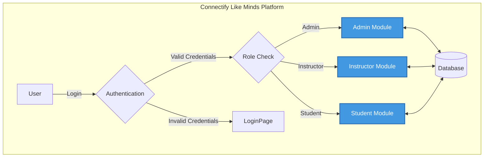
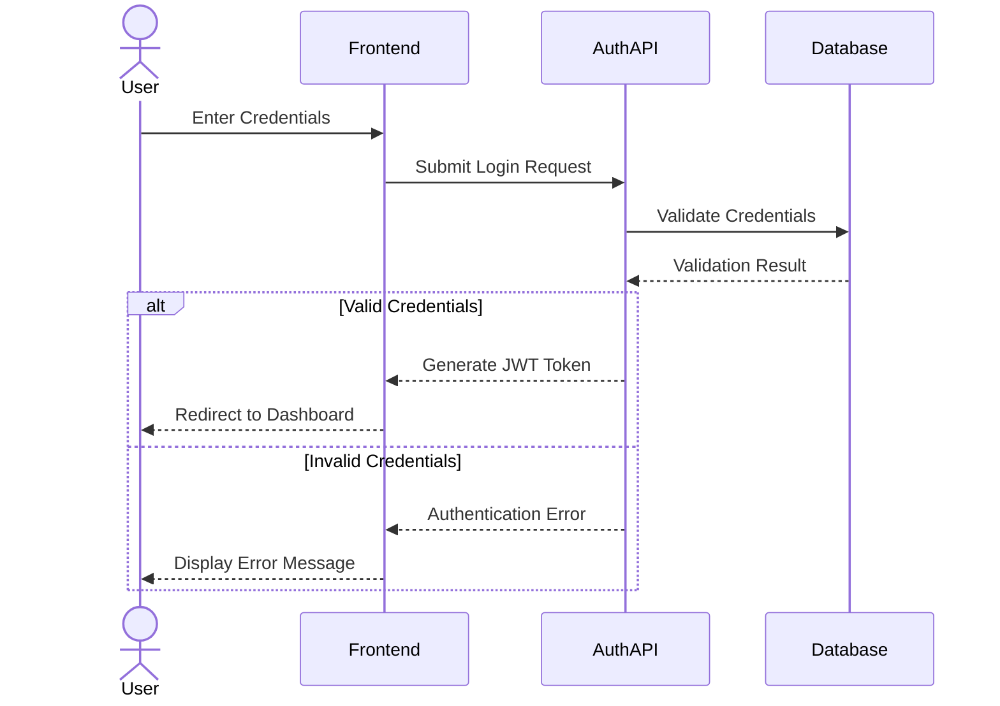
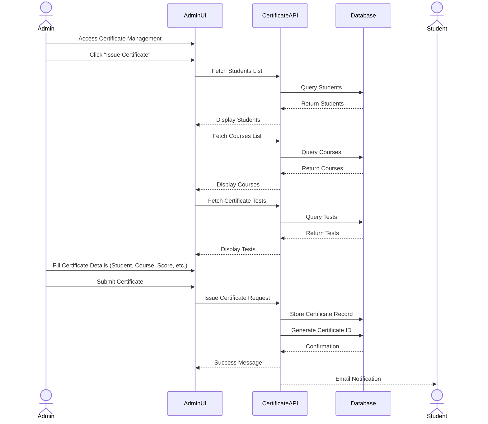
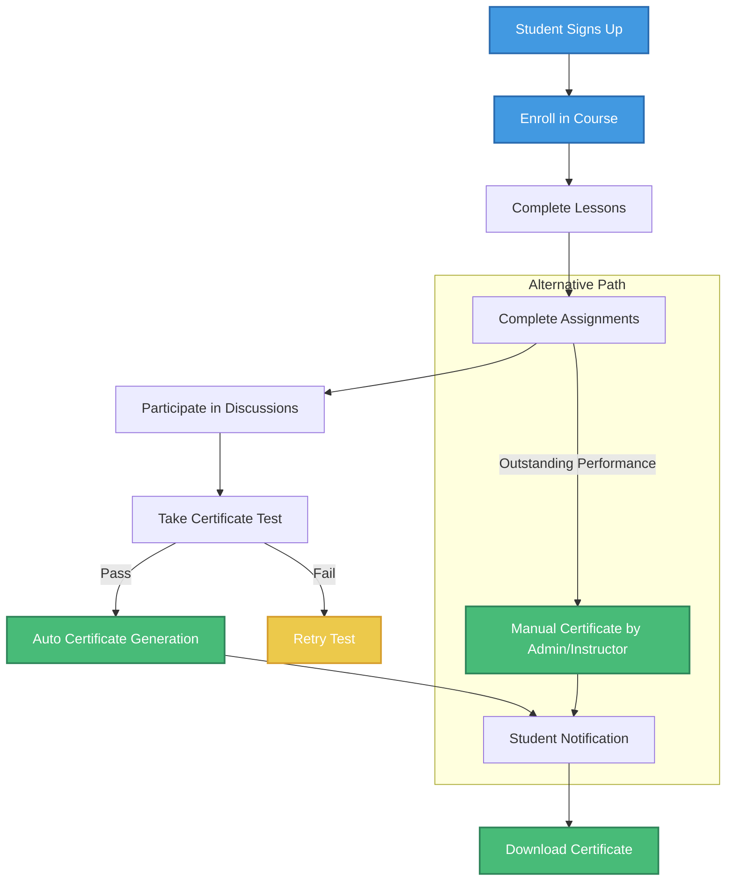
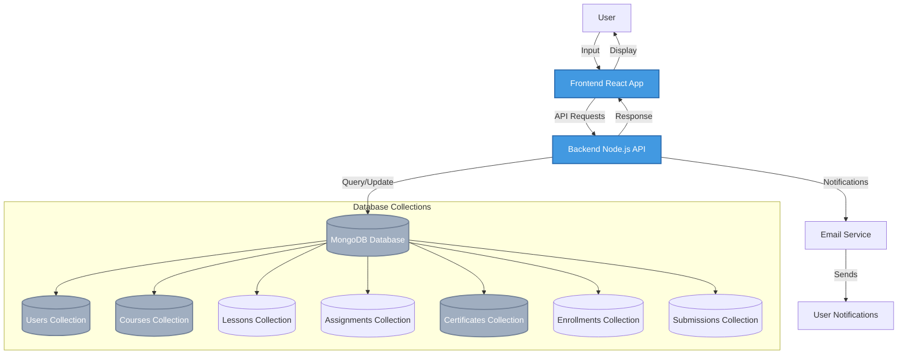

# Project Flow Charts

## System Overview

```mermaid
flowchart TD
    subgraph "Connectify Like Minds Platform"
        User[User] --> |Login| Auth{Authentication}
        Auth -->|Valid Credentials| Role{Role Check}
        Auth -->|Invalid Credentials| LoginPage
        
        Role -->|Admin| AdminModule[Admin Module]
        Role -->|Instructor| InstructorModule[Instructor Module]
        Role -->|Student| StudentModule[Student Module]
        
        Database[(Database)]
        
        AdminModule <--> Database
        InstructorModule <--> Database
        StudentModule <--> Database
    end
    
    classDef primary fill:#4299e1,stroke:#2b6cb0,stroke-width:2px,color:white
    class AdminModule,InstructorModule,StudentModule primary
```

## User Authentication Flow

```mermaid
sequenceDiagram
    actor User
    participant Frontend
    participant AuthAPI
    participant Database
    
    User->>Frontend: Enter Credentials
    Frontend->>AuthAPI: Submit Login Request
    AuthAPI->>Database: Validate Credentials
    Database-->>AuthAPI: Validation Result
    
    alt Valid Credentials
        AuthAPI-->>Frontend: Generate JWT Token
        Frontend-->>User: Redirect to Dashboard
    else Invalid Credentials
        AuthAPI-->>Frontend: Authentication Error
        Frontend-->>User: Display Error Message
    end
```

## Admin Module Flow

```mermaid
flowchart TD
    AdminDashboard[Admin Dashboard]
    
    subgraph "User Management"
        AdminDashboard --> ManageUsers[Manage Users]
        ManageUsers --> CreateUser[Create User]
        ManageUsers --> EditUser[Edit User]
        ManageUsers --> DeleteUser[Delete User]
        ManageUsers --> AssignRoles[Assign Roles]
    end
    
    subgraph "Course Management"
        AdminDashboard --> ManageCourses[Manage Courses]
        ManageCourses --> ApproveCourses[Approve Courses]
        ManageCourses --> FeatureCourses[Feature Courses]
        ManageCourses --> ManageCategories[Manage Categories]
    end
    
    subgraph "Certificate Management"
        AdminDashboard --> ManageCertificates[Manage Certificates]
        ManageCertificates --> ViewCertificates[View All Certificates]
        ManageCertificates --> IssueCertificate[Issue Certificate]
        ManageCertificates --> RevokeCertificate[Revoke Certificate]
        ManageCertificates --> DeleteCertificate[Delete Certificate]
    end
    
    subgraph "System Configuration"
        AdminDashboard --> SystemSettings[System Settings]
        SystemSettings --> EmailTemplates[Email Templates]
        SystemSettings --> SiteSettings[Site Settings]
        SystemSettings --> IntegrationSettings[Integration Settings]
    end
    
    classDef primary fill:#4299e1,stroke:#2b6cb0,stroke-width:2px,color:white
    classDef success fill:#48bb78,stroke:#2f855a,stroke-width:2px,color:white
    classDef danger fill:#f56565,stroke:#c53030,stroke-width:2px,color:white
    
    class AdminDashboard primary
    class IssueCertificate success
    class RevokeCertificate,DeleteCertificate danger
```

## Certificate Issuance Process

```mermaid
sequenceDiagram
    actor Admin
    participant AdminUI
    participant CertificateAPI
    participant Database
    actor Student
    
    Admin->>AdminUI: Access Certificate Management
    Admin->>AdminUI: Click "Issue Certificate"
    AdminUI->>CertificateAPI: Fetch Students List
    CertificateAPI->>Database: Query Students
    Database-->>CertificateAPI: Return Students
    CertificateAPI-->>AdminUI: Display Students
    
    AdminUI->>CertificateAPI: Fetch Courses List
    CertificateAPI->>Database: Query Courses
    Database-->>CertificateAPI: Return Courses
    CertificateAPI-->>AdminUI: Display Courses
    
    AdminUI->>CertificateAPI: Fetch Certificate Tests
    CertificateAPI->>Database: Query Tests
    Database-->>CertificateAPI: Return Tests
    CertificateAPI-->>AdminUI: Display Tests
    
    Admin->>AdminUI: Fill Certificate Details (Student, Course, Score, etc.)
    Admin->>AdminUI: Submit Certificate 
    AdminUI->>CertificateAPI: Issue Certificate Request
    CertificateAPI->>Database: Store Certificate Record
    CertificateAPI->>Database: Generate Certificate ID
    Database-->>CertificateAPI: Confirmation
    CertificateAPI-->>AdminUI: Success Message
    CertificateAPI-->>Student: Email Notification
```

## Student Learning Journey

```mermaid
flowchart TD
    Start[Student Signs Up] --> Enrollment[Enroll in Course]
    Enrollment --> TakeLessons[Complete Lessons]
    TakeLessons --> Assignments[Complete Assignments]
    Assignments --> Discussions[Participate in Discussions]
    Discussions --> CertTest[Take Certificate Test]
    
    CertTest -->|Pass| AutoCert[Auto Certificate Generation]
    CertTest -->|Fail| Retry[Retry Test]
    
    AutoCert --> Notification[Student Notification]
    Notification --> DownloadCert[Download Certificate]
    
    subgraph "Alternative Path"
        Assignments -->|Outstanding Performance| ManualCert[Manual Certificate by Admin/Instructor]
        ManualCert --> Notification
    end
    
    classDef primary fill:#4299e1,stroke:#2b6cb0,stroke-width:2px,color:white
    classDef success fill:#48bb78,stroke:#2f855a,stroke-width:2px,color:white
    classDef warning fill:#ecc94b,stroke:#d69e2e,stroke-width:2px,color:white
    
    class Start,Enrollment primary
    class AutoCert,ManualCert,DownloadCert success
    class Retry warning
```

## Data Flow Diagram

```mermaid
flowchart TD
    User[User] -->|Input| Frontend[Frontend React App]
    Frontend -->|API Requests| Backend[Backend Node.js API]
    Backend -->|Query/Update| Database[(MongoDB Database)]
    
    subgraph "Database Collections"
        Database --> Users[(Users Collection)]
        Database --> Courses[(Courses Collection)]
        Database --> Lessons[(Lessons Collection)]
        Database --> Assignments[(Assignments Collection)]
        Database --> Certificates[(Certificates Collection)]
        Database --> Enrollments[(Enrollments Collection)]
        Database --> Submissions[(Submissions Collection)]
    end
    
    Backend -->|Response| Frontend
    Frontend -->|Display| User
    
    Backend -->|Notifications| EmailService[Email Service]
    EmailService -->|Sends| UserNotifications[User Notifications]
    
    classDef primary fill:#4299e1,stroke:#2b6cb0,stroke-width:2px,color:white
    classDef secondary fill:#a0aec0,stroke:#718096,stroke-width:2px,color:white
    
    class Frontend,Backend primary
    class Database,Users,Courses,Certificates secondary
``` 